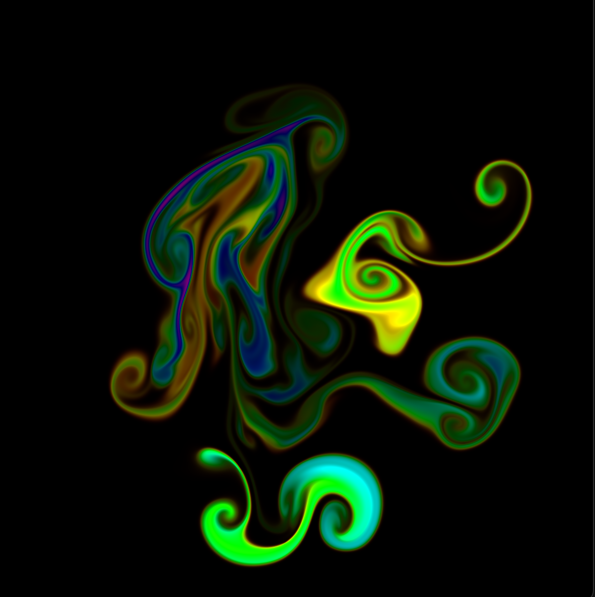
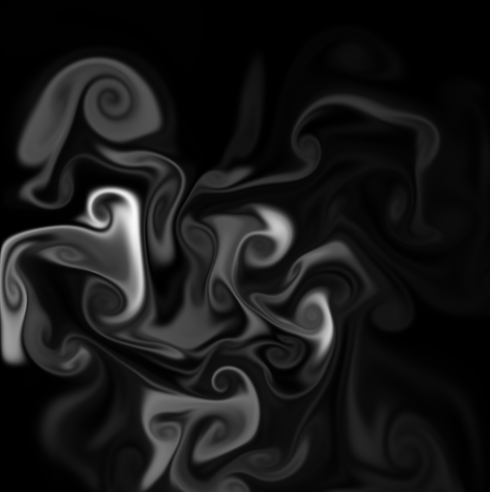

## Fluid Simulation
Created an interactive fluid dynamic simulation by implementing a numerical solver for the 2D Navier-Stokes Equations. Techniques required includes: time-space discretization, operator splitting, Method of Characteristics (semi-Lagrangian Method), Jacobi Iteration and more.

<p>
  
  
</p>

<p>
  
  
</p>


## Current Features

### 1. User Interactivity
- Handle mouse interactions (clicking, dragging) to determine external force added into the system
- Added force dependent on mouse velocity and distance to mouse position given by gaussian relationship

### 2. Advection + Pressure
- Advection implemented through method of characteristics
- Implemented Jacobi iteration to solve for pressure using finite differences and divergence calculations assuming incompressibility

### 3. Boundary Conditions
- Implemented boundary conditions at edge of canvas ensuring no pressure difference along the normal and fluids don't "escape"

### 4. Dye and Hue for Visualizaton
- Introduction of dye of specific hues for interesting visualization controlled by mouse interaction and time
- Visualized fluids based on dye intensity and hue


## Implementation
- Created separate fragment shaders for each step of the solver given by operator splitting: Force Field > Advection > Pressure > Visualization
- Organized fluid texture such that each texture location stores (ux, uy, dye, hue) where:
    - (ux, uy) is the velocity
    - dye is the amount of dye
    - hue is the colour of the dye
- Created a separate texture (1 channel) to store pressure values
- Calculate DT accurately according to framerate so simulation doesn't drastically change dependent on user machine performance


## Sources
- Real-Time Fluid Dynamics for Games: https://www.dgp.toronto.edu/public_user/stam/reality/Research/pdf/GDC03.pdf
- But How DO Fluid Simulations Work?: https://www.youtube.com/watch?v=qsYE1wMEMPA
- Ten Minute Physics: https://matthias-research.github.io/pages/tenMinutePhysics/index.html


## Build and Run
```bash
$ make
$ ./app
```


## Controls
- Mouse click and drag: add fluid forces into system
- `SPACE`: toggle Colour Mode on/off
